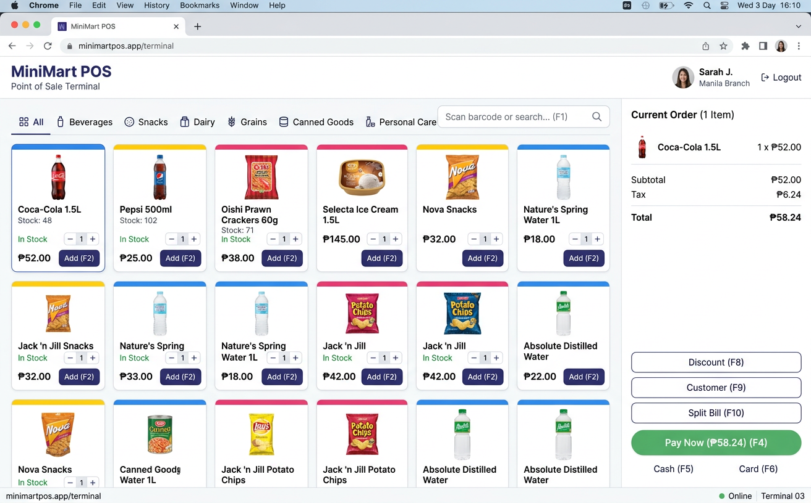
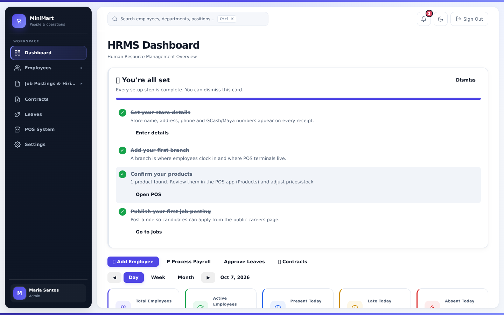
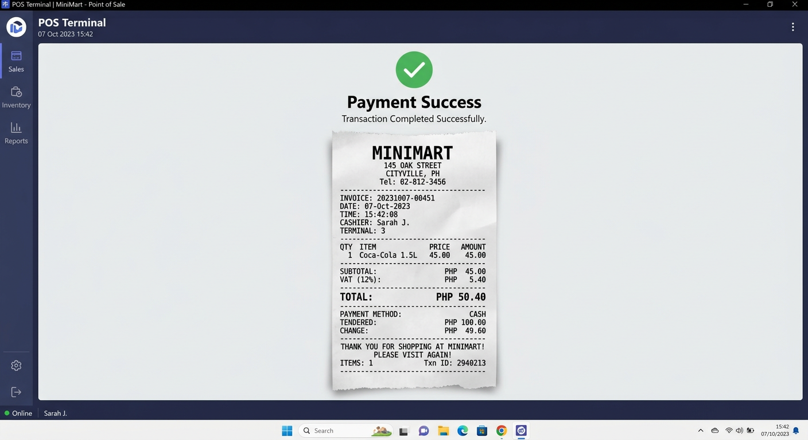

# MiniMart POS + HRMS

A complete Point of Sale and HR management system: Node.js / Express API, a React POS register, and a React HRMS, served from one process.

One app, one deploy:

- **POS** → `http://localhost:5000/pos`
- **HRMS** → `http://localhost:5000/hrms`
- **Public site / careers** → `http://localhost:5000/`
- **REST API** → `http://localhost:5000/api/v1` (HRMS under `/api/v1/hrms`)
- **API docs** → `http://localhost:5000/api-docs` (Swagger)





> Screenshots are captured by the Playwright suite (`tests/e2e`). If they are missing in a fresh clone, run `npm run build && npx playwright install chromium && npm run test:e2e`.

## Features

- **Auth** — JWT + refresh, bcrypt, role-based access (admin, manager, cashier, HR, inventory staff, employee). First-run production admin must change password.
- **POS** — barcode scan, cart, discounts, cash / GCash / Maya / split tender, held transactions, 80mm receipts, PayMongo pending + manager cash override, cashier shifts.
- **Inventory & purchasing** — stock in/out/adjust, POs, receiving, supplier balances, low-stock / expiry.
- **HRMS** — employees, attendance (clock-in/out, geofence, OT / holiday / rest-day math), leave, payroll (SSS / PhilHealth / Pag-IBIG / TRAIN), contracts, jobs, interviews.
- **Finance** — expenses, petty cash, dashboard / cashflow (business timezone, default `Asia/Manila`).
- **Public job portal** — open postings + apply (rate-limited).

## Tech stack

Node.js 22.12+ · Express · Sequelize (SQLite default, MySQL 8 optional) · React + Vite (POS + HRMS) · JWT · Joi · Vitest · Playwright

## Quick start (development)

### Prerequisites

- Node.js >= 18 (20+ recommended)
- npm

No database server is required. SQLite is created and seeded on first boot.

```bash
git clone <this-repo>
cd Portforlio          # repository root
cp .env.example .env   # optional; defaults work for local SQLite
npm run install:all    # root + frontend + frontend-hrms
npm run build          # production bundles, served by Express
npm start              # http://localhost:5000
```

Dev loop (API + Vite HMR):

```bash
npm run dev:api        # Express on :5000
npm run dev:pos        # Vite POS on :5173 (proxies /api)
npm run dev:hrms       # Vite HRMS on :3001 (proxies /api)
```

- POS: `http://localhost:5000/pos` (or the Vite origin in HMR)
- HRMS: `http://localhost:5000/hrms`
- API docs: `http://localhost:5000/api-docs`
- Health: `http://localhost:5000/health`

### Using MySQL instead of SQLite

Set these in `.env` and restart:

```
DB_DIALECT=mysql
DB_HOST=localhost
DB_PORT=3306
DB_NAME=minimart_pos
DB_USER=root
DB_PASSWORD=yourpassword
```

## Demo credentials (development only)

Seeded when `NODE_ENV=development` or `AUTO_SETUP=true`. **Never used in production** — production boots with a single first-run admin (`INITIAL_ADMIN_EMAIL` / `INITIAL_ADMIN_PASSWORD`, 12+ chars, or a generated password printed once to the logs) flagged `mustChangePassword`.

| Role            | Email                     | Password      |
|-----------------|---------------------------|---------------|
| Admin           | admin@minimart.com        | admin123      |
| HR              | hr@minimart.com           | hr123         |
| Manager         | manager@minimart.com      | admin123      |
| Cashier         | cashier@minimart.com      | cashier123    |
| Inventory staff | inventory@minimart.com    | inventory123  |
| Employee        | ligma1@gmail.com          | employee123   |

Sign in at `/hrms/login`. POS roles (cashier, manager, inventory staff) are redirected into the register.

## Tests & CI

```bash
npm run lint                 # eslint, 0 warnings
npm test                     # unit + integration (SQLite :memory:)
npm run test:coverage        # same, with v8 coverage + ratchet
npm run test:e2e:install     # Playwright Chromium
npm run build && npm run test:e2e
```

- **Unit** — money / tax / stock / payroll / attendance math, services (`tests/unit`).
- **API** — real Express app, ephemeral port, in-memory SQLite. Every protected route has a 401 case; list endpoints and core mutations have a happy path (`tests/integration`).
- **E2E** — Playwright, one Chromium project. Per-role login → main job → logout; POS cash sale + receipt; pending online pay → admin cash override (`tests/e2e/specs`).
- **CI** (`.github/workflows/ci.yml`) — lint → unit+integration+coverage (SQLite) → build both frontends → Playwright E2E → optional MySQL schema-migration job. Coverage is uploaded as an artifact (and to Codecov when a token is present).

Coverage thresholds in `vitest.config.ts` only move up.

## Deploy (Render)

See [`docs/DEPLOYMENT.md`](docs/DEPLOYMENT.md). Short version:

1. Push this repo to GitHub.
2. Render → **New → Blueprint** → `render.yaml`.
3. One web service. Set `JWT_SECRET` and `JWT_REFRESH_SECRET`. Outbound email: configure `SMTP_*` or keep `EMAIL_DISABLED=true`.

> **Storage:** the shipped blueprint is free-plan-safe (no disk), so SQLite and
> uploads live in the app directory and are reset on every deploy — Render only
> allows persistent disks on paid instances. To make data survive deploys,
> switch to `plan: starter` and uncomment the `disk:` block plus the
> `DB_STORAGE` / `UPLOAD_DIR` / `SETTINGS_FILE` env vars (all under `/data`).
> If a configured path is missing or unwritable the server logs a `[STORAGE]`
> warning and keeps running instead of crashing — see
> [Troubleshooting](docs/DEPLOYMENT.md#troubleshooting).

```
POS   https://<service>.onrender.com/pos
HRMS  https://<service>.onrender.com/hrms
Docs  https://<service>.onrender.com/api-docs   (admin-only in production)
```

Docker:

```bash
docker build -t minimart-pos .
docker run -p 8080:8080 \
  -e JWT_SECRET=... -e JWT_REFRESH_SECRET=... \
  -e EMAIL_DISABLED=true \
  -v minimart-data:/data \
  minimart-pos
```

## Environment variables

| Variable | Description | Default |
|----------|-------------|---------|
| `NODE_ENV` | `development` / `test` / `production` | development |
| `PORT` | HTTP port | 5000 |
| `AUTO_SETUP` | Dev/test only: seed demo accounts + catalog. **Ignored in production.** | — |
| `INITIAL_ADMIN_EMAIL` / `INITIAL_ADMIN_PASSWORD` | Production first-run admin (password 12+). Unset password → generated once, printed to logs. | admin@minimart.com / — |
| `DB_DIALECT` | `sqlite` or `mysql` | sqlite |
| `DB_STORAGE` | SQLite file (use a persistent volume in production; if it is not writable the app falls back and warns) | `./database.sqlite` |
| `DB_HOST` / `DB_PORT` / `DB_NAME` / `DB_USER` / `DB_PASSWORD` | MySQL | — |
| `UPLOAD_DIR` | Uploads root (must be writable; falls back with a `[STORAGE]` warning) | `./uploads` |
| `SETTINGS_FILE` | Runtime settings (baseline is `data/settings.defaults.json`) | `./data/settings.json` |
| `APP_TIMEZONE` | Business timezone for report day bounds | `Asia/Manila` |
| `JWT_SECRET` / `JWT_REFRESH_SECRET` | Required in production (boot fails without them) | generated in dev |
| `JWT_EXPIRES_IN` | Access-token TTL | 7d |
| `CORS_ORIGIN` | Extra allowed origins (comma-separated). Unset = same-origin. | same-origin |
| `EMAIL_DISABLED` | `true` disables outbound email in production (otherwise `SMTP_HOST` is required) | — |
| `SMTP_HOST` / `SMTP_PORT` / `SMTP_USER` / `SMTP_PASS` / `EMAIL_FROM` | Mail (resets, payslips, receipts) | — |
| `PAYMONGO_SECRET_KEY` / `PAYMONGO_PUBLIC_KEY` / `PAYMONGO_WEBHOOK_SECRET` | Online payments | — |
| `FRONTEND_URL` / `POS_FRONTEND_URL` | Public origin for email links / PayMongo redirects. Unset = request origin. | — |

Full template: [`.env.example`](.env.example).

## API documentation

Interactive Swagger UI:

```
http://localhost:5000/api-docs
```

A Postman collection lives at [`postman_collection.json`](postman_collection.json). All protected endpoints take:

```
Authorization: Bearer <access_token>
```

Prefix every path below with `/api/v1`.

### Authentication
| Method | Endpoint | Description |
|--------|----------|-------------|
| POST | `/auth/login` | Login |
| POST | `/auth/register` | Register (off in production unless enabled) |
| GET | `/auth/profile` | Current user |
| PUT | `/auth/profile` | Update profile |
| POST | `/auth/change-password` | Change password |
| POST | `/auth/forgot-password` | Forgot password |
| POST | `/auth/reset-password` | Reset password |
| POST | `/auth/refresh-token` | Refresh JWT |
| POST | `/auth/logout` | Revoke access token |

### POS / inventory (selected)
| Method | Endpoint | Description |
|--------|----------|-------------|
| GET | `/dashboard` | Dashboard |
| GET/POST | `/products` | List / create |
| GET | `/products/barcode/:barcode` | Scan |
| GET/POST | `/sales` | List / cash (or split) sale |
| POST | `/sales/pending` | Hold stock for online pay |
| POST | `/sales/pending/:id/cash-complete` | Admin/manager cash override |
| POST | `/sales/:id/refund` | Refund |
| POST | `/inventory/stock-in` · `/stock-out` · `/adjust` | Stock movements |
| GET/POST | `/purchases` | Purchase orders |
| GET/POST | `/shifts` | Cashier shifts |

### HRMS (selected, under `/hrms`)
| Method | Endpoint | Description |
|--------|----------|-------------|
| GET/POST | `/hrms/employees` | Employees |
| POST | `/hrms/attendance/clock-in` · `/clock-out` | Attendance |
| GET/POST | `/hrms/leaves` | Leave |
| GET/POST | `/hrms/payrolls` | Payroll |
| GET | `/hrms/me` | Self-service profile |
| GET | `/public/jobs` | Public job board |

## Project structure

```
src/                 API (Express, Sequelize, services)
frontend/            POS (React + Vite) → /
frontend-hrms/       HRMS (React + Vite) → /hrms
tests/unit           Vitest unit tests
tests/integration    HTTP tests against the real app
tests/e2e/specs      Playwright
.github/workflows    CI
docs/                Deployment + screenshots
```

## License

MIT
